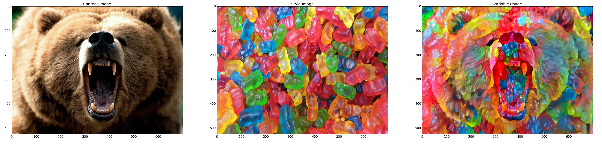

# My Deep Learning Repository

Here I will showcase some of my deep learning projects that I implement for fun\studies\work.
Most projects are using Tensorflow (Python) or MATLAB.

**More projects will be added soon :)**

# Style Transfer - [repo](https://github.com/eyalzk/style_transfer)

*Tensorflow - Python*

This is a basic Tensorflow implementation of the papar ["A Neural Algorithm of Artistic Style"](https://arxiv.org/abs/1508.06576).
The style transfer algorithm enables to render artistic images which combine the content of a selected image with a style of a different image.

 

### Contact

E-mail:eyalzk@gmail.com

[LinkedIn](https://il.linkedin.com/in/eyal-zakkay-323142aa )

